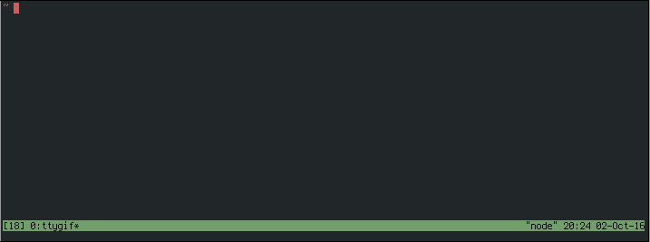

# Ding [](https://travis-ci.org/liviu-/ding)



Tired of `$ sleep 4231; beep`? This is a very simple solution to help with short-term time management. The beep sound uses the motherboard audio, so it works even if your speakers are muted, but not if you muted the PC speakers :stuck_out_tongue: . Furthermore, it works wherever there's a Linux terminal, and that includes ssh sessions.

- No dependencies other than Python itself :dizzy:
- Install with `pip` or just copy the binary somewhere in `$PATH` :sparkles:
- Python2 and Python3 compatible :star2:
- Around 100 LOC :boom:
- Only Linux has been tested for now :space_invader:

## Installation

```
$ pip install ding-ding
```

(`ding` was taken)

Alternatively, download the [ding.py](https://github.com/liviu-/ding/blob/develop/ding/ding.py) file and run it however you please.

```
$ ./ding.py in 1s
```

## Scenarios

- You want to start work after browsing the news for a bit, but you don't want to get carried away and do no work. Set a timer for 15 minutes:
```
$ ding in 15m
```
- You need to leave at 17:00 and you want to have time to get ready:
```
$ ding at 16:45
```

- [Pomodoro technique](https://en.wikipedia.org/wiki/Pomodoro_Technique)
```
$ alias pomo="ding in 25m"
$ pomo
```


## Example usage:

```
# Relative time
$ ding in 2m
$ ding in 2h 15m
$ ding in 2m 15s

# Absolute time
$ ding at 12
$ ding at 17:30
$ ding at 17:30:21
```
